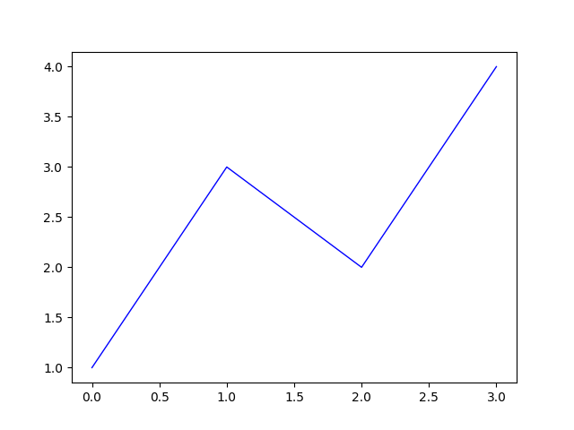
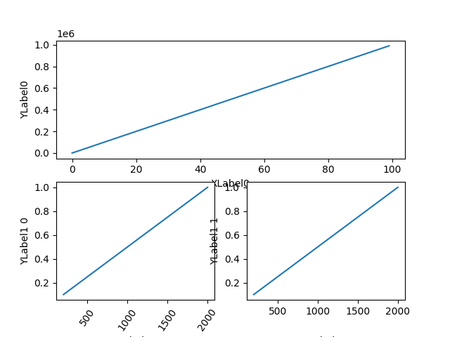
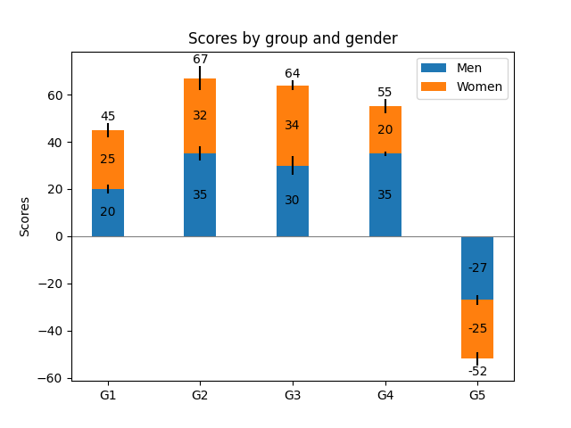
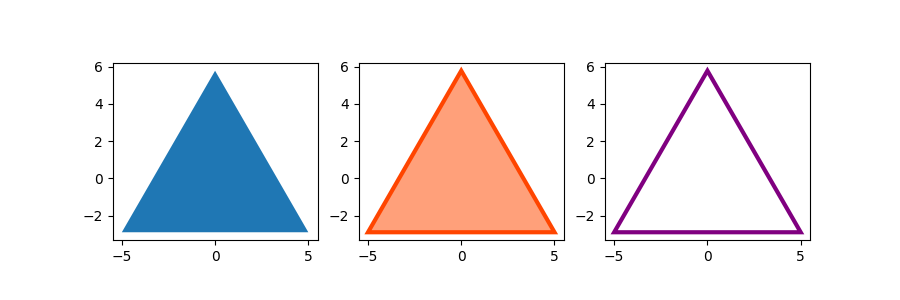
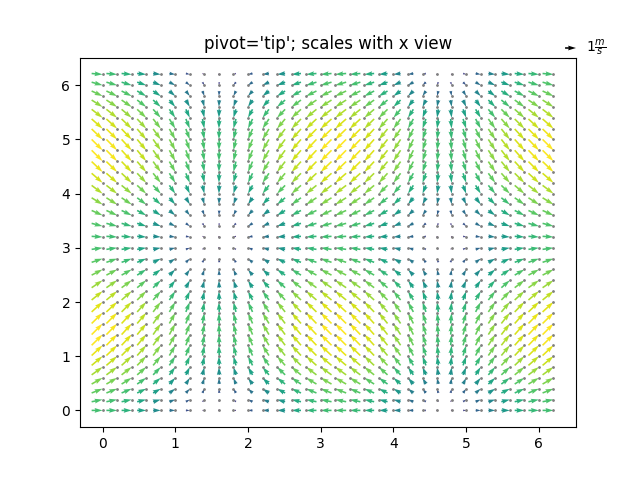
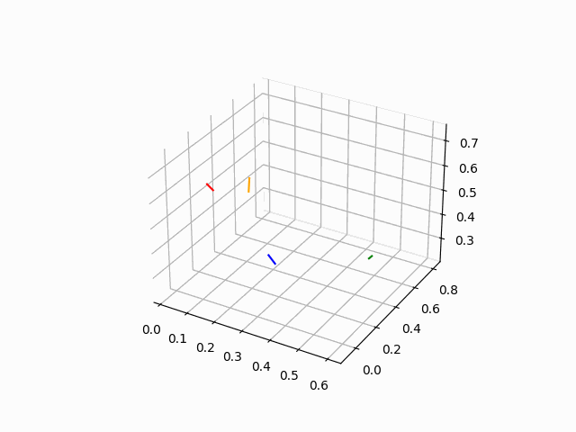

# matplotlibcpp17

A C++ header-only plotting library based on pybind11 and matplotlib

-----

This project aims to replace [matplotlibcpp](https://github.com/lava/matplotlib-cpp) using [pybind11](https://github.com/pybind/pybind11) as backend.

It is supposed to provide the user with almost full access to matplotlib features in C++, by implementing as many *wrapper classes* of matplotlib module as possible (like `axes::Axes`, `figure::Figure`). And its primary advantage over conventional matplotlibcpp is that the user can pass a variety of arguments as in the form of *args* and *kwargs* thanks to pybind11, without the need for coversion to `map<string, string>`, thus leading to more flexibility.

## Dependencies

- [pybind11](https://github.com/pybind/pybind11) >= 2.4.3
  - `sudo apt install pybind11-dev` (on Ubuntu20.04)
  - or manual install
- compatible with [matplotlib](https://matplotlib.org/stable/index.html) == 3.5.1
- numpy for `mplot3d`
- ([xtensor](https://github.com/xtensor-stack/xtensor) == 0.24.0 + [xtl](https://github.com/xtensor-stack/xtl), only for `gallery` demos)

## Installation

```bash
$ mdkir build; cd build;
$ cmake .. -DADD_DEMO=0 (-DCMAKE_INSTALL_PREFIX=<custom path>)
$ make -j
$ make install
$ (make uninstall)
```

For using matplotlibcpp17 from CMakeLists.txt, see [hello_world](https://github.com/soblin/matplotlibcpp17/tree/master/hello_world) example.

```bash
find_package(matplotlibcpp17)
...
target_link_libraries(a.out matplotlibcpp17::matplotlibcpp17)
```

Or you could just add include path to `include` directory and compile your codes as descibed in [minimal example](#minimal-example).

## Syntax

The user will need to capsulate *arguments* in `Args(arg1, arg2, ...) == pybind11:tuple` and *keyword arguments* in `Kwargs("k1"_a = v1, "k2"_a = v2, ...) == pybind11::dict`. The returned value is either a `pybind11::object` or a corresponding wrapper class. Please refer to the reference and examples below.
- exception: `subplots`, `TBD`s
- conversion: Wrapper class of matplotlibcpp17 like [::container::BarContainer](https://github.com/soblin/matplotlibcpp17/blob/master/include/matplotlibcpp17/container.h) needs to be passed to python interpreter using `unwrap()` method in *args* and *kwargs*.

## Examples

### minimal example

```cpp
g++ ./hello_world/hello_world.cpp -std=c++17 -I./include -I/usr/include/python3.x -I<path to pybind11> -lpython3.x
./a.out
```

gives



### example1 - subplots

From [gallery/subplots_axes_and_figures/align_labels_demo.cpp](https://github.com/soblin/matplotlibcpp17/blob/master/gallery/subplots_axes_and_figures/align_labels_demo.cpp).

- [original python code](https://matplotlib.org/stable/gallery/subplots_axes_and_figures/align_labels_demo.html)

```cpp
  auto plt = matplotlibcpp17::pyplot::import();

  // corresponding wrapper class for returned value is implemented in this library
  /// gs is of type gridspec::GridSpec
  auto gs = GridSpec(2, 2);

  /// pass wrapper class object like gs[0, :] of ::gridspec::SubplotSpec to the interpreter using .unwrap() method as python object
  auto ax = fig.add_subplot(Args(gs(0, py::slice(0, 2, 1)).unwrap()));

  ax.plot(Args(arange(0, 1000000, 10000)));
  ax.set_ylabel(Args("YLabel0"));
  ax.set_xlabel(Args("XLabel0"));
```



### example2 - bar plot

From [gallery/lines_bars_and_markers/bar_label_demo.cpp](https://github.com/soblin/matplotlibcpp17/blob/master/gallery/lines_bars_and_markers/bar_label_demo.cpp). Here `subplots()` returns `tuple<Figure, Axes>`.

- [original python code](https://matplotlib.org/stable/gallery/lines_bars_and_markers/bar_label_demo.html)

```cpp
  auto [fig, ax] = plt.subplots();
  auto p1 = ax.bar(Args(ind, menMeans, width),
                   Kwargs("yerr"_a = menStd, "label"_a = "Men"));
  auto p2 = ax.bar(
      Args(ind, womenMeans, width),
      Kwargs("bottom"_a = menMeans, "yerr"_a = womenStd, "label"_a = "Women"));
  ax.axhline(Args(0), Kwargs("color"_a = "grey", "linewidth"_a = 0.8));
  ax.set_ylabel(Args("Scores"));
  ax.set_title(Args("Scores by group and gender"));

  ax.set_xticks(Args(ind, py::make_tuple("G1", "G2", "G3", "G4", "G5")));
  ax.legend();

  // pass wrapper class object like p1 of ::container::BarContainer to the interpreter using .unwrap() method as python object
  ax.bar_label(Args(p1.unwrap()), Kwargs("label_type"_a = "center"));
  ax.bar_label(Args(p2.unwrap()), Kwargs("label_type"_a = "center"));
  ax.bar_label(Args(p2.unwrap()));
  plt.show();
```



### example3 - fill

Fucntions like `subplots`, `TBD`s are overloaded because they return different types depending on the arguments. Here `subplots()` returns `tuple<Figure, vector<Axes>>`.

From [gallery/lines_bars_and_markers](https://github.com/soblin/matplotlibcpp17/blob/master/gallery/lines_bars_and_markers/fill.cpp)

- [original python code](https://matplotlib.org/stable/gallery/lines_bars_and_markers/fill.html)

```cpp
  auto [fig, axes] =
      plt.subplots(1, 3,
                   Kwargs("figsize"_a = py::make_tuple(9, 3),
                           "subplot_kw"_a = py::dict("aspect"_a = "equal")));
  auto ax1 = axes[0], ax2 = axes[1], ax3 = axes[2];
```



### example4 - quiver

Use `.unwrap()` method to pass wrapper class of matplotlibcpp17 to plotting functions.

From [gallery/images_contours_and_fields/quiver_demo.cpp](https://github.com/soblin/matplotlibcpp17/blob/master/gallery/images_contours_and_fields/quiver_demo.cpp)

- [original python code](https://matplotlib.org/stable/gallery/images_contours_and_fields/quiver_demo.html)

```cpp
  auto plt = matplotlibcpp17::pyplot::import();
  auto [fig1, ax1] = plt.subplots();
  ax1.set_title(Args("Arrows scale with plot width, not view"));
  auto Q = ax1.quiver(Args(X, Y, U, V, M),
                      Kwargs("units"_a = "x", "pivot"_a = "tip",
                              "width"_a = 0.022, "scale"_a = 1.0 / 0.15));
  auto qk =
      ax1.quiverkey(Args(Q.unwrap(), 0.9, 0.9, 1, R"($1 \frac{m}{s}$)"),
                    Kwargs("labelpos"_a = "E", "coordinates"_a = "figure"));
  ax1.scatter(Args(X, Y), Kwargs("color"_a = "0.5", "s"_a = 1));
```



### example5 - gif

Currently only `ArtistAnimation` is supported. `FuncAnimation` interface maybe implemented in the future.

From [gallery/artist_animation/random_walk.cpp](https://github.com/soblin/matplotlibcpp17/blob/master/gallery/artist_animation/random_walk.cpp)

- [original python code](https://matplotlib.org/stable/gallery/animation/random_walk.html)



## Demos

`gallery` folder contains corresponding examples from [the official website of matplotlib](https://matplotlib.org/stable/gallery) with the same structure.

### build

If you do not need to build the demos, use `-DADD_DEMO=0` (by default it is `1`).

```bash
$ mkdir build; cd build
$ cmake .. -DADD_DEMO={0, 1} -DUSE_GUI={0, 1}
$ make -j
```

If you do not need to see the demo with `plt.show()`, use `-DUSE_GUI=0` (by default it is `1`). Otherwise the executables will `plt.savefig()` to `gallery/images` directory.

`make <gallery directory name>` runs all the executables under that directory.

```bash
make lines_bars_and_markers
```

## Contributing

Contributions to this project are welcome if you could add or want/need more modules :)
